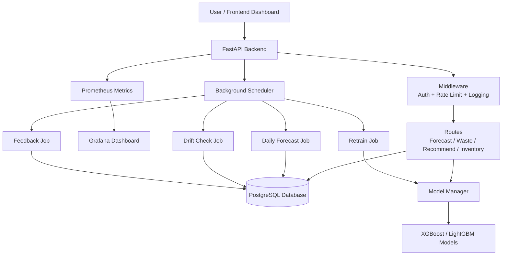

```mermaid
flowchart TD
    U[User / Frontend Dashboard] --> API[FastAPI Backend]

    API --> MW[Middleware<br/>Auth + Rate Limit + Logging]
    MW --> R[Routes<br/>Forecast / Waste / Recommend / Inventory]

    R --> DB[(PostgreSQL Database)]
    R --> MM[Model Manager]
    MM --> XGB[XGBoost / LightGBM Models]

    API --> MET[Prometheus Metrics]
    MET --> G[Grafana Dashboard]

    API --> SCH[Background Scheduler]
    SCH --> J1[Daily Forecast Job]
    SCH --> J2[Drift Check Job]
    SCH --> J3[Feedback Job]
    SCH --> J4[Retrain Job]

    J1 --> DB
    J2 --> DB
    J3 --> DB
    J4 --> MM
``` 