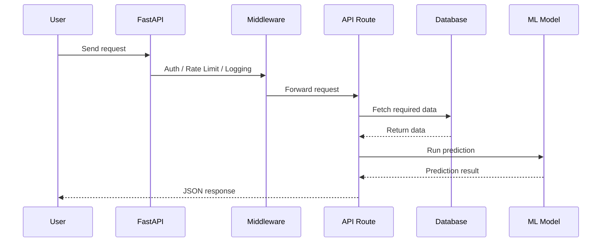

```mermaid
sequenceDiagram
    participant User
    participant API as FastAPI
    participant MW as Middleware
    participant Route as API Route
    participant DB as Database
    participant Model as ML Model

    User->>API: Send request
    API->>MW: Auth / Rate Limit / Logging
    MW->>Route: Forward request
    Route->>DB: Fetch required data
    DB-->>Route: Return data
    Route->>Model: Run prediction
    Model-->>Route: Prediction result
    Route-->>User: JSON response
``` 