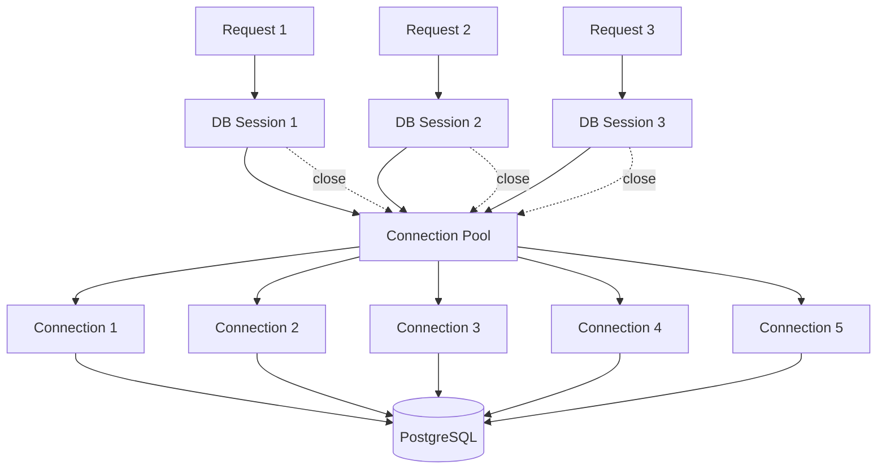

```mermaid
flowchart TD
    R1[Request 1] --> S1[DB Session 1]
    R2[Request 2] --> S2[DB Session 2]
    R3[Request 3] --> S3[DB Session 3]

    S1 --> P[Connection Pool]
    S2 --> P
    S3 --> P

    P --> C1[Connection 1]
    P --> C2[Connection 2]
    P --> C3[Connection 3]
    P --> C4[Connection 4]
    P --> C5[Connection 5]

    C1 --> DB[(PostgreSQL)]
    C2 --> DB
    C3 --> DB
    C4 --> DB
    C5 --> DB

    S1 -.close.-> P
    S2 -.close.-> P
    S3 -.close.-> P
``` 