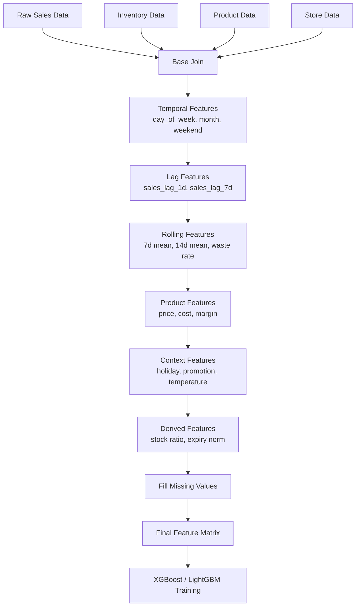

```mermaid
flowchart TD
    A[Raw Sales Data] --> B[Base Join]
    I[Inventory Data] --> B
    P[Product Data] --> B
    S[Store Data] --> B

    B --> T[Temporal Features<br/>day_of_week, month, weekend]
    T --> L[Lag Features<br/>sales_lag_1d, sales_lag_7d]
    L --> R[Rolling Features<br/>7d mean, 14d mean, waste rate]
    R --> PF[Product Features<br/>price, cost, margin]
    PF --> C[Context Features<br/>holiday, promotion, temperature]
    C --> D[Derived Features<br/>stock ratio, expiry norm]
    D --> F[Fill Missing Values]
    F --> M[Final Feature Matrix]
    M --> X[XGBoost / LightGBM Training]
``` 