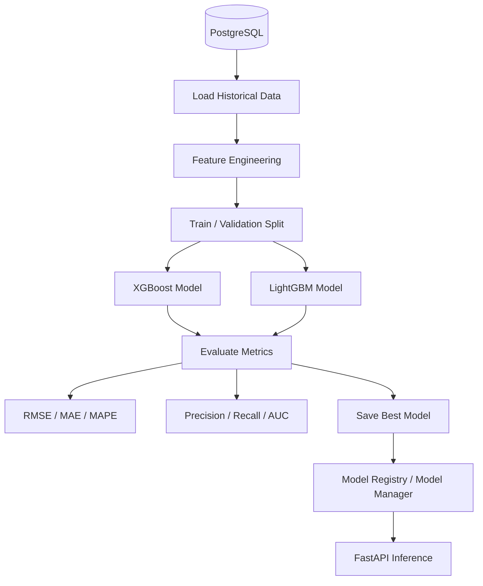

```mermaid
flowchart TD
    DB[(PostgreSQL)] --> Q[Load Historical Data]
    Q --> FE[Feature Engineering]
    FE --> SPLIT[Train / Validation Split]

    SPLIT --> XGB[XGBoost Model]
    SPLIT --> LGBM[LightGBM Model]

    XGB --> E[Evaluate Metrics]
    LGBM --> E

    E --> RMSE[RMSE / MAE / MAPE]
    E --> CLS[Precision / Recall / AUC]

    E --> SAVE[Save Best Model]
    SAVE --> REG[Model Registry / Model Manager]
    REG --> API[FastAPI Inference]
```