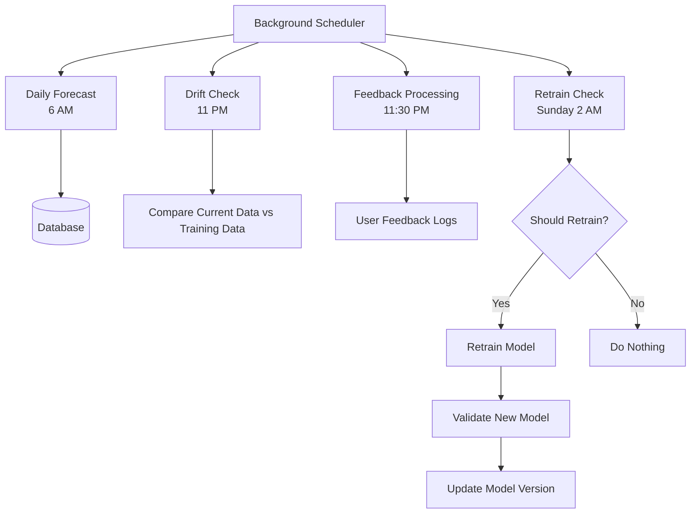

```mermaid
flowchart TD
    SCH[Background Scheduler] --> F[Daily Forecast<br/>6 AM]
    SCH --> D[Drift Check<br/>11 PM]
    SCH --> FB[Feedback Processing<br/>11:30 PM]
    SCH --> R[Retrain Check<br/>Sunday 2 AM]

    F --> DB[(Database)]
    D --> DRIFT[Compare Current Data vs Training Data]
    FB --> LOG[User Feedback Logs]
    R --> CHECK{Should Retrain?}

    CHECK -- Yes --> TRAIN[Retrain Model]
    CHECK -- No --> STOP[Do Nothing]

    TRAIN --> VAL[Validate New Model]
    VAL --> DEPLOY[Update Model Version]
``` 