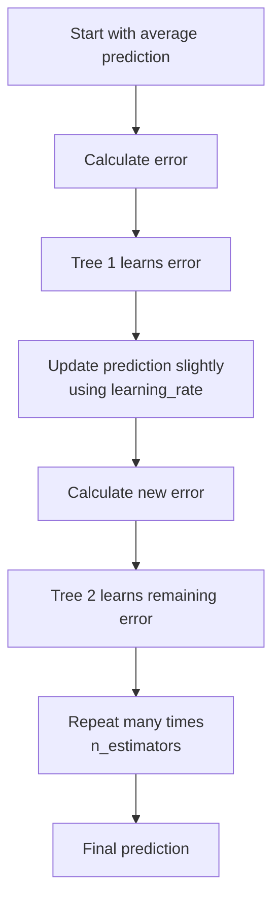

```mermaid
flowchart TD
    A[Start with average prediction] --> B[Calculate error]
    B --> C[Tree 1 learns error]
    C --> D[Update prediction slightly<br/>using learning_rate]
    D --> E[Calculate new error]
    E --> F[Tree 2 learns remaining error]
    F --> G[Repeat many times<br/>n_estimators]
    G --> H[Final prediction]
``` 